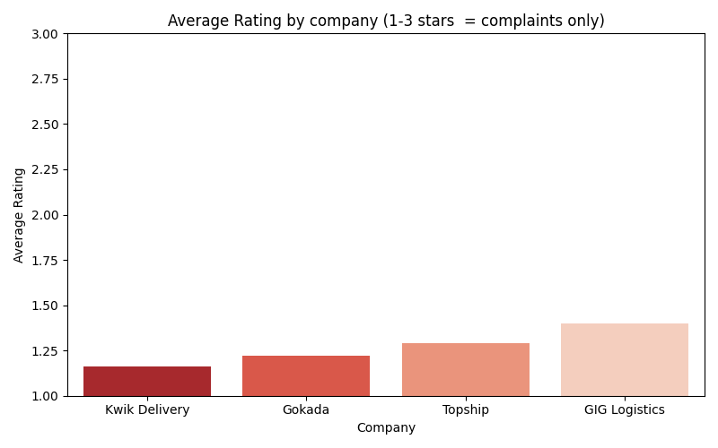
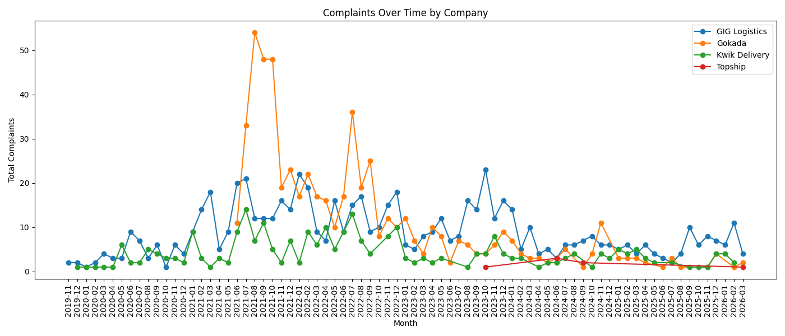
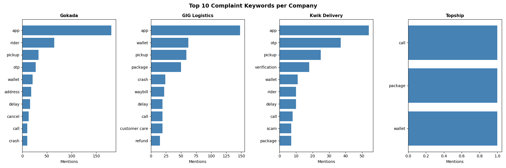

# 🚚 Naija Logistics Intelligence

A competitive intelligence engine that scrapes, analyzes and visualizes 
user complaints from Nigeria's top logistics apps on Google Play Store.

Built with Python, SQL (SQLite) and matplotlib.

## 🎯 Project Goal

To identify the biggest pain points in Nigerian logistics apps using 
real user review data — and use those insights to validate a SaaS product idea.

Instead of guessing what to build, this project lets the data decide.

## 📱 Apps Analyzed

| Company | Category | Reviews Scraped |
|---|---|---|
| GIG Logistics (GIGGO) | Last-Mile | 683 |
| Gokada | Last-Mile | 591 |
| Kwik Delivery | Last-Mile | 282 |
| Topship | Traditional Express | 7 |

**Total: 1,563 reviews** (1, 2 and 3 star ratings only)  
**Period covered: 2019 — 2026**

## 🔍 Key Findings

- **App quality** is the #1 complaint across all companies
- **Wallet/payment issues** — money gets debited but service not delivered
- **OTP/verification** — Kwik Delivery users can't even sign up since 2020
- **No rider assigned** — Gokada's biggest operational failure
- **Refunds** — chronic across all companies, never fully resolved
- **Tracking** — packages go silent after pickup with no updates

## 🛠️ Tech Stack

- `Python` — scraping and analysis
- `google-play-scraper` — fetches reviews directly from Google Play
- `pandas` — data cleaning and transformation
- `SQLite + DBeaver` — SQL analysis and querying
- `matplotlib + seaborn` — data visualization

## 📁 Project Structure
```
naija_logistics_intel/
├── scraper.py          # Scrapes reviews from Google Play
├── analysis.py         # Runs SQL queries and saves results
├── charts.py           # Generates charts from results
├── tests/              # App ID discovery scripts
├── results/            # CSV outputs from analysis
└── charts/             # PNG chart outputs
```

## 📊 Charts

### Average Rating by Company


### Complaints Over Time


### Top Complaint Keywords per Company


## 🚀 How to Run
```bash
# Install dependencies
pip install google-play-scraper pandas matplotlib seaborn

# Scrape fresh reviews
python scraper.py

# Run analysis
python analysis.py

# Generate charts
python charts.py
```

## 💡 Next Steps

- Automate weekly scraping with GitHub Actions
- Add NLP topic modeling to surface deeper patterns
- Expand to Apple App Store reviews
- Use findings to build a logistics SaaS MVP
